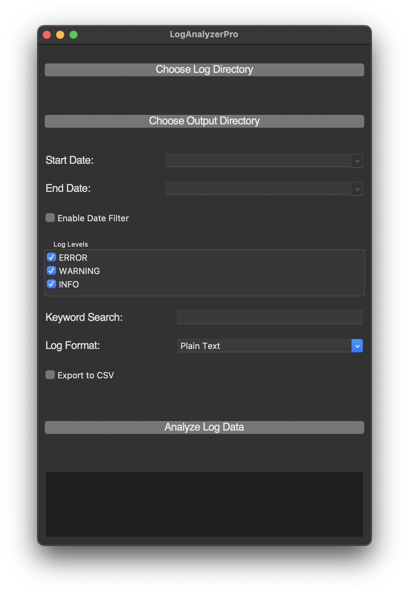

# LogAnalyzerPro

## About This Project

LogAnalyzerPro is a powerful and versatile tool designed to analyze log files in various formats (Plain Text, JSON, CSV). It provides features such as log level filtering, keyword search, date range filtering, and export options. This tool is ideal for developers, system administrators, and anyone who needs to gain insights from log data.

## Usage

1. **Choose Log Directory**: Select the directory containing your log files.
2. **Choose Output Directory**: Select the directory where the analysis results will be saved.
3. **Set Date Range** (optional): Enable and set the date range for filtering logs.
4. **Select Log Levels**: Choose the log levels to include in the analysis (ERROR, WARNING, INFO).
5. **Keyword Search** (optional): Enter a keyword to filter logs containing the keyword.
6. **Select Log Format**: Choose the format of the log files (Plain Text, JSON, CSV).
7. **Export to CSV** (optional): Enable this option to export the analysis results to a CSV file.
8. **Analyze Log Data**: Click the "Analyze Log Data" button to start the analysis.

## Features

- Supports multiple log formats: Plain Text, JSON, CSV
- Log level filtering (ERROR, WARNING, INFO)
- Keyword search
- Date range filtering
- Export results to JSON and CSV
- User-friendly GUI

## Installation

### macOS

1. **Install Python and Tkinter**:

   ```sh
   brew install python-tk
   ```

2. **Install Required Packages**:
   ```sh
   pip install -r requirements.txt
   ```

### Windows

1. **Install Python: Download and install Python from python.org. Ensure "Add Python to PATH" is checked during installation.**

2. **Install Required Python Packages:**
   ```sh
   pip install -r requirements.txt
   ```

### Linux

1. **Install Python and Tkinter**:

- **Debian/Ubuntu**:

```sh
sudo apt-get install python3-tk
```

- **Fedora**:

```sh
 sudo dnf install python3-tkinter
```

- **Arch**:

```sh
  sudo pacman -S tk
```

2. **Install Required Packages**:

```sh
pip install -r requirements.txt
```

### How to Run

```
git clone https://github.com/karthik558/LogAnalyzerPro.git
cd LogAnalyzerPro
python log-analyzer-pro.py
```

### Screenshots



### Common Errors and Solutions

1. **Venv not found**

   - **Solution**: Create a virtual environment using the following command:

     ```sh
     python -m venv venv
     ```

     Activate the virtual environment using the following command:

     ```sh
     source venv/bin/activate
     ```

2. **ModuleNotFoundError: No module named 'tkcalendar or tkinter'**

   - **Solution**: Install the required module using the following command:

     ```sh
     pip install tkcalendar
     ```

     ```sh
     pip install tkinter
     ```

### Contributing

**Contributions are welcome! Please follow these steps to contribute:**

1. _Fork the repository._
2. _Create a new branch (git checkout -b feature/YourFeature)._
3. _Commit your changes (git commit -m 'Add some feature')._
4. _Push to the branch (git push origin feature/YourFeature)_.
5. _Open a pull request._

### License

**This project is licensed under the MIT License. See the LICENSE file for details.**

```markdown
Feel free to customize the content and replace the placeholder paths and URLs with your actual project details. Let me know if you need any further adjustments or additional sections!
```
